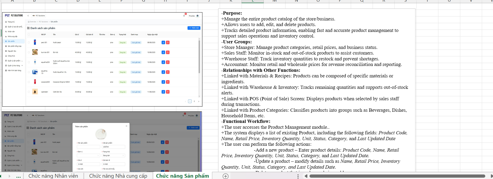
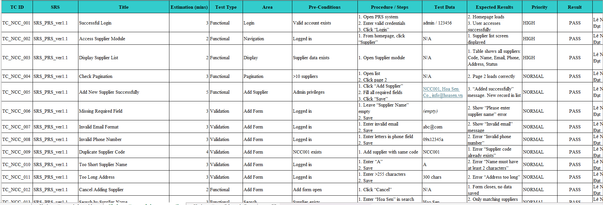
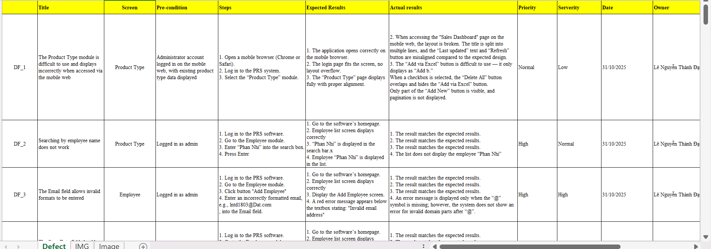

# PRS_Retail_Store_Software
Viết TestCase, DefectList cho phần mềm quản lý cửa hàng bán lẻ  

# Retail Store Management System Testing

## 📌 Description
This repository contains testing artifacts for the Retail Store Management System (PRS).

## 🧪 Scope
- Understand requirements
- Test Plan
- Test Case Design
- Defect List
- Test Report
  
## 📂 Documents
- Tìm Hiểu Yêu cầu: /TimHieuYeuCau.xlsx
  
  
- Test Plan: /TestPlan.docx
- Test Cases: /23211tt2037_LeNguyenThanhDat_testcase_PRS_ver1.0.xlsx  
  
  
- Defect List: /23211tt2037_LeNguyenThanhDat_DefectList_PRS_Ver1.0.xlsx  
  
  
- Review: /23211tt2037_LeNguyenThanhDat_PRSReview.xlsx
- Test Report: /TestReport.docx
  
## 📊 Summary

| STT | Function | Test Case | PASS | FAIL | BLOCKED |
|-----|----------|----------|------|------|---------|
| 1 | Loại sản phẩm | 50 | 44 | 3 | 3 |
| 2 | Nhân viên | 50 | 39 | 11 | 0 |
| 3 | Nhà cung cấp | 50 | 43 | 6 | 1 |
| 4 | Sản phẩm | 50 | 43 | 5 | 2 |
| **Total** |  | **200** | **169** | **25** | **6** |

- Tổng số lỗi được ghi nhận: **51 lỗi** (bao gồm lỗi nội bộ và lỗi bên ngoài trong bộ test case).

## 🛠 Tools
- Excel
- Manual Testing
